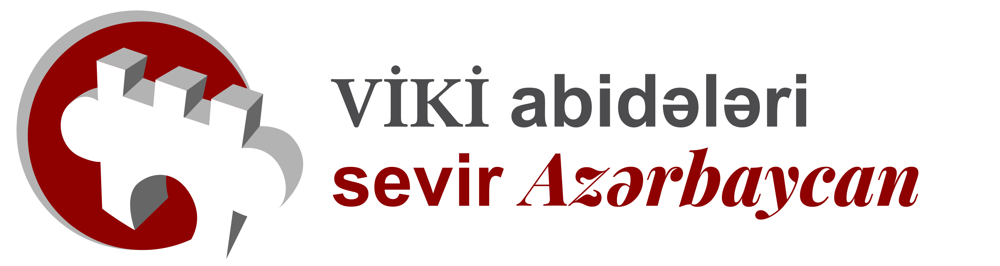

# Wiki Loves Monuments Azerbaijan - Interactive Map


 


**wlmaz** is a full-stack mapping application designed to help contributors discover heritage monuments in Azerbaijan and upload photos directly to Wikimedia Commons.

It features a responsive map interface powered by Vue 3 and Leaflet, backed by a secure Node.js proxy that handles MediaWiki OAuth authentication and uploads.

## Features

- **Interactive Map:** Viewport-aware, canvas-rendered markers that stream in per animation frame, keeping thousands of monuments responsive without clustering overhead.
- **Fuzzy Search:** Fast, client-side search across thousands of monuments with fuzzy matching capabilities.
- **MediaWiki OAuth:** Secure authentication using existing Wikimedia accounts.
- **Direct Uploads:** Seamless photo uploads to Wikimedia Commons directly from the interface.
- **Deep Linking & SEO:** Every monument gets a unique static page at `/monument/<inventory-id>` (prerendered from the GeoJSON data) plus a `sitemap.xml`.
- **Rich Metadata:** Automatic image credits, Wikidata integration, and Schema.org structured data.
- **Mobile Optimized:** Fully responsive sidebar and map controls designed for field use.
- **Persistence:** Redis-backed session and rate-limit stores in production, with in-memory fallbacks in local dev mode.

## Getting Started

### Prerequisites

- **Node.js:** v24.14.1 or higher.
- **npm:** Use npm for package management.
- **Redis:** Required for session management in production.

### 1. Clone & Install

```bash
git clone https://gitlab.wikimedia.org/nmw03/wlmaz.git
cd wlmaz
npm install
```

### 2. Environment Setup

Create a `.env` file in the root directory (see `.env.example` for all options):

```bash
WM_CONSUMER_KEY=
WM_CONSUMER_SECRET=

NODE_ENV=
PORT=3000
CLIENT_URL=http://localhost:5173
SESSION_SECRET=ChangeMeToARandomStringAtLeast32CharsLong
REDIS_URL=redis://:redispassword@localhost:6379
```

### 3. Start Redis (Docker)

If you don't have Redis installed locally, you can start it using Docker:

```bash
docker run -d --name wlmaz-redis -p 6379:6379 redis:alpine
```

### 4. Run Development Server

This command runs both the Vite Frontend and the Express Backend concurrently.

```bash
npm run dev
```

- Frontend: http://localhost:5173
- Backend: http://localhost:3000

### Local MediaWiki upload testing (development only)

By default the dev build targets Wikimedia Commons via the standard OAuth
login (using `WM_CONSUMER_KEY` / `WM_CONSUMER_SECRET`). To test the **complete
upload pipeline** against a local MediaWiki instance instead — without logging
in — enable the Bot Password dev mode:

```env
# Local MediaWiki upload testing — development only
MEDIAWIKI_DEV_MODE=true
MEDIAWIKI_API_URL=http://localhost:8080/w/api.php
MEDIAWIKI_DEV_USERNAME=BotName@BotPasswordName
MEDIAWIKI_DEV_BOT_PASSWORD=...
```

- Use `NODE_ENV=development` (or leave it unset). **This mode is completely
  ignored when `NODE_ENV=production`**, even if these variables are set.
- The backend authenticates server-side to the configured API using a
  **MediaWiki Bot Password** (login-token flow) and performs uploads from that
  session. No user session/login is required.
- `MEDIAWIKI_DEV_BOT_PASSWORD` is **never** sent to the browser or included in
  the Vite client bundle — uploads happen entirely server-side. The UI only
  receives a safe config (`{ localUploadEnabled, mediaWikiUrl }`) from
  `GET /upload/config`.
- The API URL comes only from server configuration; client input can never
  select an arbitrary MediaWiki URL.
- With this mode enabled the backend **does not require**
  `WM_CONSUMER_KEY`/`WM_CONSUMER_SECRET` to start — the Commons OAuth strategy
  is only registered when local dev mode is off. In production the keys are
  always required.

To create a Bot Password: log into your local wiki, visit
`Special:BotPasswords`, and create a bot with permission to
`Edit existing pages` / `Upload new files`. The username is of the form
`AccountName@BotName` (this is what goes in `MEDIAWIKI_DEV_USERNAME`); the
generated password goes in `MEDIAWIKI_DEV_BOT_PASSWORD`.

**Local wiki templates:** the upload generates Commons-specific wikitext
(`{{Information}}`, `{{date}}`, `{{Cultural Heritage Azerbaijan|N}}`,
`{{Wiki Loves Monuments 2026|az}}`, license templates). On a bare local wiki
these render as red links but the upload itself still succeeds — they are plain
text pages. Install matching templates locally if you want them to render, or
omit the monument `inventory` when uploading to avoid the heritage template.

> **Security:** these credentials are for local testing only. Never commit
> real bot passwords, and always keep `NODE_ENV=production` for real usage.

## Development Workflow

- `npm run dev` — Vite frontend + Express backend concurrently.
- `npm run build` — typecheck, Vite build, prerender static monument pages
  (and the generated `monument-redirects.conf` nginx include), verify output,
  then bundle the server.
- `npm run test` — Vitest unit tests (`npm run test:watch` to watch).
- `npm run typecheck` — `vue-tsc` across `src/` and `scripts/`.
- `npm run lint` / `npm run lint:fix` — ESLint without auto-fix / with auto-fix.
- `npm run format` — Prettier (prints files it would rewrite).
- `npm run update-data` — re-pull monument data from Wikidata and regenerate the
  PBF used by the map.

Server configuration lives in `src/config.ts`; shared application constants live
in `src/utils/constants.ts`.

## License

This project is licensed under the MIT License.
